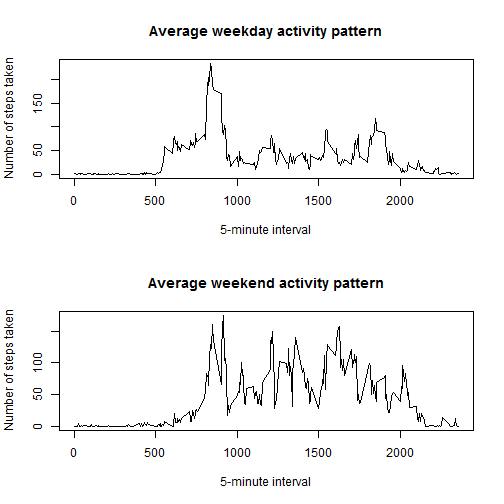

## Loading and preprocessing the data

Firslty, let's unzip and load data:

```r
unzip('activity.zip')
csv_data <- read.csv('activity.csv', colClasses = c("numeric", "character", "numeric"))
```

dplyr package will be used for further processing:

```r
library(dplyr)
data <- tbl_df(csv_data)
data
```

```
## Source: local data frame [17,568 x 3]
## 
##    steps       date interval
## 1     NA 2012-10-01        0
## 2     NA 2012-10-01        5
## 3     NA 2012-10-01       10
## 4     NA 2012-10-01       15
## 5     NA 2012-10-01       20
## 6     NA 2012-10-01       25
## 7     NA 2012-10-01       30
## 8     NA 2012-10-01       35
## 9     NA 2012-10-01       40
## 10    NA 2012-10-01       45
## ..   ...        ...      ...
```

## What is mean total number of steps taken per day?

Let's look at a histogram of the total number of steps taken each day:

```r
steps_per_day <- group_by(data, date)
sum_of_steps_per_day <- summarise(steps_per_day, sum_steps = sum(steps))
hist(sum_of_steps_per_day$sum_steps, main = "Total number of steps taken each day", xlab = "Steps taken", ylab = "Number")
```

 

Let's look at mean and median total number of steps taken per day:

```r
summarise(steps_per_day, mean_steps = mean(steps), median_steps = median(steps))
```

```
## Source: local data frame [61 x 3]
## 
##          date mean_steps median_steps
## 1  2012-10-01         NA           NA
## 2  2012-10-02  0.4375000            0
## 3  2012-10-03 39.4166667            0
## 4  2012-10-04 42.0694444            0
## 5  2012-10-05 46.1597222            0
## 6  2012-10-06 53.5416667            0
## 7  2012-10-07 38.2465278            0
## 8  2012-10-08         NA           NA
## 9  2012-10-09 44.4826389            0
## 10 2012-10-10 34.3750000            0
## 11 2012-10-11 35.7777778            0
## 12 2012-10-12 60.3541667            0
## 13 2012-10-13 43.1458333            0
## 14 2012-10-14 52.4236111            0
## 15 2012-10-15 35.2048611            0
## 16 2012-10-16 52.3750000            0
## 17 2012-10-17 46.7083333            0
## 18 2012-10-18 34.9166667            0
## 19 2012-10-19 41.0729167            0
## 20 2012-10-20 36.0937500            0
## 21 2012-10-21 30.6284722            0
## 22 2012-10-22 46.7361111            0
## 23 2012-10-23 30.9652778            0
## 24 2012-10-24 29.0104167            0
## 25 2012-10-25  8.6527778            0
## 26 2012-10-26 23.5347222            0
## 27 2012-10-27 35.1354167            0
## 28 2012-10-28 39.7847222            0
## 29 2012-10-29 17.4236111            0
## 30 2012-10-30 34.0937500            0
## 31 2012-10-31 53.5208333            0
## 32 2012-11-01         NA           NA
## 33 2012-11-02 36.8055556            0
## 34 2012-11-03 36.7048611            0
## 35 2012-11-04         NA           NA
## 36 2012-11-05 36.2465278            0
## 37 2012-11-06 28.9375000            0
## 38 2012-11-07 44.7326389            0
## 39 2012-11-08 11.1770833            0
## 40 2012-11-09         NA           NA
## 41 2012-11-10         NA           NA
## 42 2012-11-11 43.7777778            0
## 43 2012-11-12 37.3784722            0
## 44 2012-11-13 25.4722222            0
## 45 2012-11-14         NA           NA
## 46 2012-11-15  0.1423611            0
## 47 2012-11-16 18.8923611            0
## 48 2012-11-17 49.7881944            0
## 49 2012-11-18 52.4652778            0
## 50 2012-11-19 30.6979167            0
## 51 2012-11-20 15.5277778            0
## 52 2012-11-21 44.3993056            0
## 53 2012-11-22 70.9270833            0
## 54 2012-11-23 73.5902778            0
## 55 2012-11-24 50.2708333            0
## 56 2012-11-25 41.0902778            0
## 57 2012-11-26 38.7569444            0
## 58 2012-11-27 47.3819444            0
## 59 2012-11-28 35.3576389            0
## 60 2012-11-29 24.4687500            0
## 61 2012-11-30         NA           NA
```

## What is the average daily activity pattern?

Let's look at a time series plot of the 5-minute interval and the average number of steps taken, averaged across all days:

```r
steps_per_interval <- group_by(data, interval)
mean_of_steps_per_interval <- summarise(steps_per_interval, mean_steps = mean(steps, na.rm=TRUE))
plot(mean_of_steps_per_interval$interval, mean_of_steps_per_interval$mean_steps, type="l", main = "Average daily activity pattern", xlab = "5-minute interval", ylab = "Number of steps taken, averaged across all days")
```

 

Now let's find which 5-minute interval, on average across all the days in the dataset, contains the maximum number of steps:

```r
max_interval <- slice(mean_of_steps_per_interval, which.max(mean_of_steps_per_interval$mean_steps))
```
Interval #835 contains the maximum number of steps, on average across all the days in the dataset, and its value is 206.1698113.

## Imputing missing values

We can note that there are a number of days/intervals where there are missing values (coded as NA). The presence of missing days may introduce bias into some calculations or summaries of the data. Let's calculate the total number of missing values in the dataset:

```r
na_count <- summarize(filter(data, is.na(steps)), n())
```
The the total number of missing values in the dataset is 2304.

Let's fill in all of the missing values in the dataset. The filling strategy is to use the mean for corresponding 5-minute interval:

```r
nona_data <- mutate(data, steps = ifelse(is.na(steps), slice(mean_of_steps_per_interval, which(mean_of_steps_per_interval$interval == interval))$mean_steps, steps))
nona_data
```

```
## Source: local data frame [17,568 x 3]
## 
##        steps       date interval
## 1  1.7169811 2012-10-01        0
## 2  0.3396226 2012-10-01        5
## 3  0.1320755 2012-10-01       10
## 4  0.1509434 2012-10-01       15
## 5  0.0754717 2012-10-01       20
## 6  2.0943396 2012-10-01       25
## 7  0.5283019 2012-10-01       30
## 8  0.8679245 2012-10-01       35
## 9  0.0000000 2012-10-01       40
## 10 1.4716981 2012-10-01       45
## ..       ...        ...      ...
```

Let's look at a histogram of the total number of steps taken each day for corrected dataset:

```r
nona_steps_per_day <- group_by(nona_data, date)
nona_sum_of_steps_per_day <- summarise(nona_steps_per_day, sum_steps = sum(steps))
hist(nona_sum_of_steps_per_day$sum_steps, main = "Total number of steps taken each day", xlab = "Steps taken", ylab = "Number")
```

 

Let's also look at mean and median total number of steps taken per day for corrected dataset:

```r
summarise(nona_steps_per_day, mean_steps = mean(steps), median_steps = median(steps))
```

```
## Source: local data frame [61 x 3]
## 
##          date mean_steps median_steps
## 1  2012-10-01 37.3825996     34.11321
## 2  2012-10-02  0.4375000      0.00000
## 3  2012-10-03 39.4166667      0.00000
## 4  2012-10-04 42.0694444      0.00000
## 5  2012-10-05 46.1597222      0.00000
## 6  2012-10-06 53.5416667      0.00000
## 7  2012-10-07 38.2465278      0.00000
## 8  2012-10-08 37.3825996     34.11321
## 9  2012-10-09 44.4826389      0.00000
## 10 2012-10-10 34.3750000      0.00000
## 11 2012-10-11 35.7777778      0.00000
## 12 2012-10-12 60.3541667      0.00000
## 13 2012-10-13 43.1458333      0.00000
## 14 2012-10-14 52.4236111      0.00000
## 15 2012-10-15 35.2048611      0.00000
## 16 2012-10-16 52.3750000      0.00000
## 17 2012-10-17 46.7083333      0.00000
## 18 2012-10-18 34.9166667      0.00000
## 19 2012-10-19 41.0729167      0.00000
## 20 2012-10-20 36.0937500      0.00000
## 21 2012-10-21 30.6284722      0.00000
## 22 2012-10-22 46.7361111      0.00000
## 23 2012-10-23 30.9652778      0.00000
## 24 2012-10-24 29.0104167      0.00000
## 25 2012-10-25  8.6527778      0.00000
## 26 2012-10-26 23.5347222      0.00000
## 27 2012-10-27 35.1354167      0.00000
## 28 2012-10-28 39.7847222      0.00000
## 29 2012-10-29 17.4236111      0.00000
## 30 2012-10-30 34.0937500      0.00000
## 31 2012-10-31 53.5208333      0.00000
## 32 2012-11-01 37.3825996     34.11321
## 33 2012-11-02 36.8055556      0.00000
## 34 2012-11-03 36.7048611      0.00000
## 35 2012-11-04 37.3825996     34.11321
## 36 2012-11-05 36.2465278      0.00000
## 37 2012-11-06 28.9375000      0.00000
## 38 2012-11-07 44.7326389      0.00000
## 39 2012-11-08 11.1770833      0.00000
## 40 2012-11-09 37.3825996     34.11321
## 41 2012-11-10 37.3825996     34.11321
## 42 2012-11-11 43.7777778      0.00000
## 43 2012-11-12 37.3784722      0.00000
## 44 2012-11-13 25.4722222      0.00000
## 45 2012-11-14 37.3825996     34.11321
## 46 2012-11-15  0.1423611      0.00000
## 47 2012-11-16 18.8923611      0.00000
## 48 2012-11-17 49.7881944      0.00000
## 49 2012-11-18 52.4652778      0.00000
## 50 2012-11-19 30.6979167      0.00000
## 51 2012-11-20 15.5277778      0.00000
## 52 2012-11-21 44.3993056      0.00000
## 53 2012-11-22 70.9270833      0.00000
## 54 2012-11-23 73.5902778      0.00000
## 55 2012-11-24 50.2708333      0.00000
## 56 2012-11-25 41.0902778      0.00000
## 57 2012-11-26 38.7569444      0.00000
## 58 2012-11-27 47.3819444      0.00000
## 59 2012-11-28 35.3576389      0.00000
## 60 2012-11-29 24.4687500      0.00000
## 61 2012-11-30 37.3825996     34.11321
```

Let's examine what is the impact of imputing missing data on the estimates of the total daily number of steps:

```r
nona_sum_of_steps_per_day$sum_steps - as.numeric(sum_of_steps_per_day$sum_steps)
```

```
##  [1] NA  0  0  0  0  0  0 NA  0  0  0  0  0  0  0  0  0  0  0  0  0  0  0
## [24]  0  0  0  0  0  0  0  0 NA  0  0 NA  0  0  0  0 NA NA  0  0  0 NA  0
## [47]  0  0  0  0  0  0  0  0  0  0  0  0  0  0 NA
```
We can see, that for all not-NA values, number of steps was not changed.

## Are there differences in activity patterns between weekdays and weekends?


```r
datetype_data <- mutate(data, day_type = as.factor(ifelse(weekdays(as.Date(nona_data$date)) %in% c("суббота", "воскресенье"), 'weekend', 'weekday')))
datetype_steps_per_interval <- group_by(datetype_data, interval, day_type)
datetype_mean_of_steps_per_interval <- summarise(datetype_steps_per_interval, mean_steps = mean(steps, na.rm=TRUE))

weekday_mean_of_steps_per_interval <- filter(datetype_mean_of_steps_per_interval, day_type == "weekday")
weekend_mean_of_steps_per_interval <- filter(datetype_mean_of_steps_per_interval, day_type == "weekend")
par(mfrow = c(2, 1))
plot(weekday_mean_of_steps_per_interval$interval, weekday_mean_of_steps_per_interval$mean_steps, type="l")
plot(weekend_mean_of_steps_per_interval$interval, weekend_mean_of_steps_per_interval$mean_steps, type="l")
```

 
