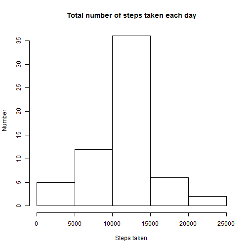

## Loading and preprocessing the data

Firslty, let's unzip and load data:

```r
unzip('activity.zip')
csv_data <- read.csv('activity.csv', colClasses = c("numeric", "character", "numeric"))
```

dplyr package will be used for further processing:

```r
library(dplyr)
data <- tbl_df(csv_data)
data
```

```
## Source: local data frame [17,568 x 3]
## 
##    steps       date interval
## 1     NA 2012-10-01        0
## 2     NA 2012-10-01        5
## 3     NA 2012-10-01       10
## 4     NA 2012-10-01       15
## 5     NA 2012-10-01       20
## 6     NA 2012-10-01       25
## 7     NA 2012-10-01       30
## 8     NA 2012-10-01       35
## 9     NA 2012-10-01       40
## 10    NA 2012-10-01       45
## ..   ...        ...      ...
```

## What is mean total number of steps taken per day?


```r
steps_per_day <- group_by(data, date)
sum_of_steps_per_day <- summarise(steps_per_day, sum_steps = sum(steps))
hist(sum_of_steps_per_day$sum_steps)
```

 


```r
summarise(steps_per_day, mean_steps = mean(steps))
```

```
## Source: local data frame [61 x 2]
## 
##          date mean_steps
## 1  2012-10-01         NA
## 2  2012-10-02  0.4375000
## 3  2012-10-03 39.4166667
## 4  2012-10-04 42.0694444
## 5  2012-10-05 46.1597222
## 6  2012-10-06 53.5416667
## 7  2012-10-07 38.2465278
## 8  2012-10-08         NA
## 9  2012-10-09 44.4826389
## 10 2012-10-10 34.3750000
## 11 2012-10-11 35.7777778
## 12 2012-10-12 60.3541667
## 13 2012-10-13 43.1458333
## 14 2012-10-14 52.4236111
## 15 2012-10-15 35.2048611
## 16 2012-10-16 52.3750000
## 17 2012-10-17 46.7083333
## 18 2012-10-18 34.9166667
## 19 2012-10-19 41.0729167
## 20 2012-10-20 36.0937500
## 21 2012-10-21 30.6284722
## 22 2012-10-22 46.7361111
## 23 2012-10-23 30.9652778
## 24 2012-10-24 29.0104167
## 25 2012-10-25  8.6527778
## 26 2012-10-26 23.5347222
## 27 2012-10-27 35.1354167
## 28 2012-10-28 39.7847222
## 29 2012-10-29 17.4236111
## 30 2012-10-30 34.0937500
## 31 2012-10-31 53.5208333
## 32 2012-11-01         NA
## 33 2012-11-02 36.8055556
## 34 2012-11-03 36.7048611
## 35 2012-11-04         NA
## 36 2012-11-05 36.2465278
## 37 2012-11-06 28.9375000
## 38 2012-11-07 44.7326389
## 39 2012-11-08 11.1770833
## 40 2012-11-09         NA
## 41 2012-11-10         NA
## 42 2012-11-11 43.7777778
## 43 2012-11-12 37.3784722
## 44 2012-11-13 25.4722222
## 45 2012-11-14         NA
## 46 2012-11-15  0.1423611
## 47 2012-11-16 18.8923611
## 48 2012-11-17 49.7881944
## 49 2012-11-18 52.4652778
## 50 2012-11-19 30.6979167
## 51 2012-11-20 15.5277778
## 52 2012-11-21 44.3993056
## 53 2012-11-22 70.9270833
## 54 2012-11-23 73.5902778
## 55 2012-11-24 50.2708333
## 56 2012-11-25 41.0902778
## 57 2012-11-26 38.7569444
## 58 2012-11-27 47.3819444
## 59 2012-11-28 35.3576389
## 60 2012-11-29 24.4687500
## 61 2012-11-30         NA
```

## What is the average daily activity pattern?


```r
steps_per_interval <- group_by(data, interval)
mean_of_steps_per_interval <- summarise(steps_per_interval, mean_steps = mean(steps, na.rm=TRUE))
plot(mean_of_steps_per_interval$interval, mean_of_steps_per_interval$mean_steps, type="l")
```

 


```r
slice(mean_of_steps_per_interval, which.max(mean_of_steps_per_interval$mean_steps))
```

```
## Source: local data frame [1 x 2]
## 
##   interval mean_steps
## 1      835   206.1698
```

## Imputing missing values


```r
summarize(filter(data, is.na(steps)), n())
```

```
## Source: local data frame [1 x 1]
## 
##    n()
## 1 2304
```


```r
nona_data <- mutate(data, steps = ifelse(is.na(steps), slice(mean_of_steps_per_interval, which(mean_of_steps_per_interval$interval == interval))$mean_steps, steps))
nona_data
```

```
## Source: local data frame [17,568 x 3]
## 
##        steps       date interval
## 1  1.7169811 2012-10-01        0
## 2  0.3396226 2012-10-01        5
## 3  0.1320755 2012-10-01       10
## 4  0.1509434 2012-10-01       15
## 5  0.0754717 2012-10-01       20
## 6  2.0943396 2012-10-01       25
## 7  0.5283019 2012-10-01       30
## 8  0.8679245 2012-10-01       35
## 9  0.0000000 2012-10-01       40
## 10 1.4716981 2012-10-01       45
## ..       ...        ...      ...
```


```r
nona_steps_per_day <- group_by(nona_data, date)
nona_sum_of_steps_per_day <- summarise(nona_steps_per_day, sum_steps = sum(steps))
hist(nona_sum_of_steps_per_day$sum_steps)
```

 


```r
summarise(nona_steps_per_day, mean_steps = mean(steps))
```

```
## Source: local data frame [61 x 2]
## 
##          date mean_steps
## 1  2012-10-01 37.3825996
## 2  2012-10-02  0.4375000
## 3  2012-10-03 39.4166667
## 4  2012-10-04 42.0694444
## 5  2012-10-05 46.1597222
## 6  2012-10-06 53.5416667
## 7  2012-10-07 38.2465278
## 8  2012-10-08 37.3825996
## 9  2012-10-09 44.4826389
## 10 2012-10-10 34.3750000
## 11 2012-10-11 35.7777778
## 12 2012-10-12 60.3541667
## 13 2012-10-13 43.1458333
## 14 2012-10-14 52.4236111
## 15 2012-10-15 35.2048611
## 16 2012-10-16 52.3750000
## 17 2012-10-17 46.7083333
## 18 2012-10-18 34.9166667
## 19 2012-10-19 41.0729167
## 20 2012-10-20 36.0937500
## 21 2012-10-21 30.6284722
## 22 2012-10-22 46.7361111
## 23 2012-10-23 30.9652778
## 24 2012-10-24 29.0104167
## 25 2012-10-25  8.6527778
## 26 2012-10-26 23.5347222
## 27 2012-10-27 35.1354167
## 28 2012-10-28 39.7847222
## 29 2012-10-29 17.4236111
## 30 2012-10-30 34.0937500
## 31 2012-10-31 53.5208333
## 32 2012-11-01 37.3825996
## 33 2012-11-02 36.8055556
## 34 2012-11-03 36.7048611
## 35 2012-11-04 37.3825996
## 36 2012-11-05 36.2465278
## 37 2012-11-06 28.9375000
## 38 2012-11-07 44.7326389
## 39 2012-11-08 11.1770833
## 40 2012-11-09 37.3825996
## 41 2012-11-10 37.3825996
## 42 2012-11-11 43.7777778
## 43 2012-11-12 37.3784722
## 44 2012-11-13 25.4722222
## 45 2012-11-14 37.3825996
## 46 2012-11-15  0.1423611
## 47 2012-11-16 18.8923611
## 48 2012-11-17 49.7881944
## 49 2012-11-18 52.4652778
## 50 2012-11-19 30.6979167
## 51 2012-11-20 15.5277778
## 52 2012-11-21 44.3993056
## 53 2012-11-22 70.9270833
## 54 2012-11-23 73.5902778
## 55 2012-11-24 50.2708333
## 56 2012-11-25 41.0902778
## 57 2012-11-26 38.7569444
## 58 2012-11-27 47.3819444
## 59 2012-11-28 35.3576389
## 60 2012-11-29 24.4687500
## 61 2012-11-30 37.3825996
```

## Are there differences in activity patterns between weekdays and weekends?


```r
datetype_data <- mutate(data, day_type = as.factor(ifelse(weekdays(as.Date(nona_data$date)) %in% c("суббота", "воскресенье"), 'weekend', 'weekday')))
datetype_steps_per_interval <- group_by(datetype_data, interval, day_type)
datetype_mean_of_steps_per_interval <- summarise(datetype_steps_per_interval, mean_steps = mean(steps, na.rm=TRUE))

weekday_mean_of_steps_per_interval <- filter(datetype_mean_of_steps_per_interval, day_type == "weekday")
weekend_mean_of_steps_per_interval <- filter(datetype_mean_of_steps_per_interval, day_type == "weekend")
par(mfrow = c(2, 1))
plot(weekday_mean_of_steps_per_interval$interval, weekday_mean_of_steps_per_interval$mean_steps, type="l")
plot(weekend_mean_of_steps_per_interval$interval, weekend_mean_of_steps_per_interval$mean_steps, type="l")
```

 
